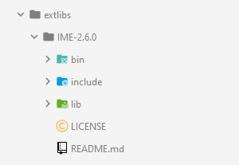

## Overview

This project is a clone of the 1980 Pac-Man arcade game using my 2D game engine, [Infinite Motion Engine](https://github.com/KwenaMashamaite/IME). 
I tried to make the game as close to the [original game](https://www.gamasutra.com/view/feature/3938/the_pacman_dossier.php?print=1) as 
possible without the glitch screen.

You can check out another similar clone of mine; [Super Pac-Man clone](https://github.com/KwenaMashamaite/SuperPacMan).

## How to play

1. [Download](https://github.com/KwenaMashamaite/PacMan/releases/tag/v1.1.0)
   the game
2. Extract the zip archive
3. Run _PacMan.exe_
4. Enjoy :video_game:

## Gameplay


## User Interface


## Build

###### *Read this section if you want to build the game yourself, otherwise you may skip it.*

This project is a CMake project, therefore you must download and install [CMake](https://cmake.org/). 
You also need to download [Infinite Motion Engine](https://github.com/KwenaMashamaite/IME) _v2.4.0_,
then:

1. Clone the repository
```git
$ git clone https://github.com/KwenaMashamaite/PacMan
```   
2. Create a folder in the root of the directory created in step 1 and name it `extlibs`
3. Extract **IME** to the `extlibs` folder created in step 2. It should look like:


   
At this point your ready to build the project. The easiest way to do this is to
use an IDE.

To build the game using the *CLI*, run the following commands from the project root 
directory:

```shell
mkdir build
cd build
cmake ..
cmake --build .
```

After the build process completes, you will find the game executable in `PacMan/bin`
folder

## Platform

This game only runs on the Windows platform. It was tested on Windows 10.

## License

Pac-Man clone is licensed under the [MIT](LICENSE) license.
